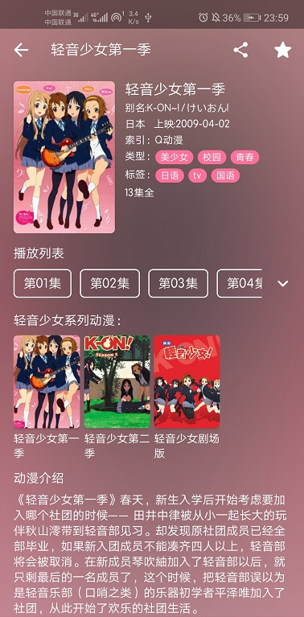
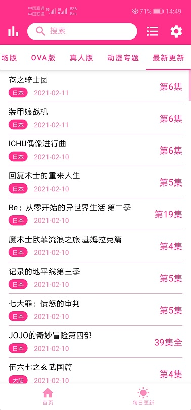
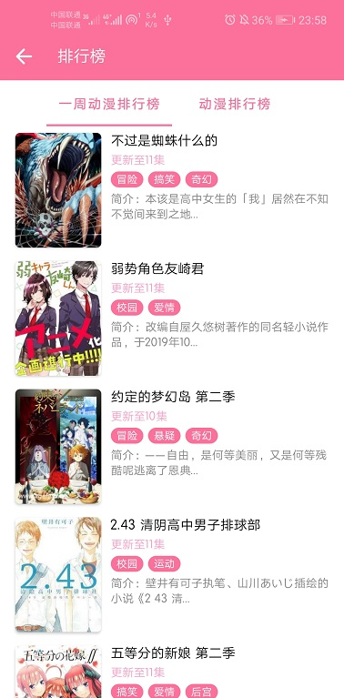
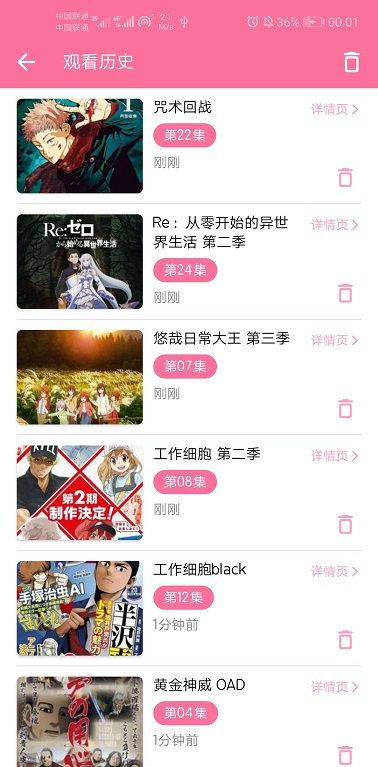

    <h1>樱花动漫</h1>
    

        
        
        
        
        
	

    

        樱花动漫第三方安卓Android客户端，免费开源，目的是学习Android开发。（仅支持Android 5及以上版本）
    

----

## [>>必看使用说明(自定义数据源)<<](doc/customdatasource/README.md)

## [>>必看安全说明<<](#安全说明)

## [>>关于http网站或数据源的安全问题<<](doc/about_http_security.md)

## 特色功能

1. 支持显示**排行榜**
2. 支持显示**每日更新**的番剧
3. 支持**分类查看**动漫
4. 支持**双指缩放**、**移动**、**旋转**视频
5. 支持视频**投屏**到电视
6. 支持部分视频**显示**、**发送弹幕**（需要数据源支持弹幕）
7. 支持输入某站弹幕链接播放网络弹幕（例如https://api.bilibili.com/x/v1/dm/list.so?oid=97495910）
8. 支持**缓存视频**到本地（暂不支持m3u8格式资源缓存）
9. 支持**追番**（数据保存在本地）
10. 支持显示**观看历史**记录
11. 支持显示**搜索历史**记录
12. 支持改变视频**播放速度**
13. 支持改变**视频**显示**比例**（16:9, 4:3, 全屏等）
14. [支持**自定义**显示**数据源**](doc/customdatasource/README.md)
15. ......

## 运行截图

 

  

  

 

  

 

## 安全说明

**请勿**私自**传播APK**安装包，Github仓库为唯一长期仓库，**请仅在Github仓库下载安装包**，请勿下载来历不明的应用与ads包，谨防隐私泄露，谨防受骗！

### 已发现未知来源的APK

其APK可能经过未知修改，**存在风险**，建议**立即卸载**！

包括但不限于以下版本：

- 9.9.9至尊
- 9.9.9至尊II
- 9.9.9至尊终极版
- 9.9.9II
- 12.14妹妹专属版
- 1.2.2
- 1.2.3
- 果哥9.9.1706

若确实想定制，请**自行编译**源码生成APK，**而不是破解**已有的APK安装包！

## 应用主要权限说明

### 存储

1. 读取存储卡中的内容：缓存动漫功能需要读取本地存储卡中缓存的视频文件
2. 修改或删除存储卡中的内容：缓存动漫功能需要修改记录缓存信息的xml文件

### 电话

1. 读取设备通话状态和识别码：友盟+SDK需要收集您的设备Mac地址、唯一设备识别码以提供统计分析服务

### 位置信息

1. 访问大致、确切位置：友盟+SDK会通过地理位置校准报表数据准确性，提供基础反作弊能力

### 其它应用功能

2. 防止手机休眠：投屏到电视功能需要
3. 允许接收WLAN多播：投屏到电视功能需要

## 附加说明

App内不提供默认数据源，需要用户自行导入使用。 

## 免责声明

1. 此软件**只提供数据显示**，**不提供原始数据**。
2. 此软件显示的所有内容，其**版权**均**归原作者**所有。
3. 此软件**仅可用作学习交流**，未经授权，**禁止用于其他用途**，请在下载**24小时内删除**。
4. 因使用此软件产生的版权问题，软件作者概不负责。

## 许可证

使用此软件代码需**遵循以下许可证协议**

[**GNU General Public License v3.0**](LICENSE)

