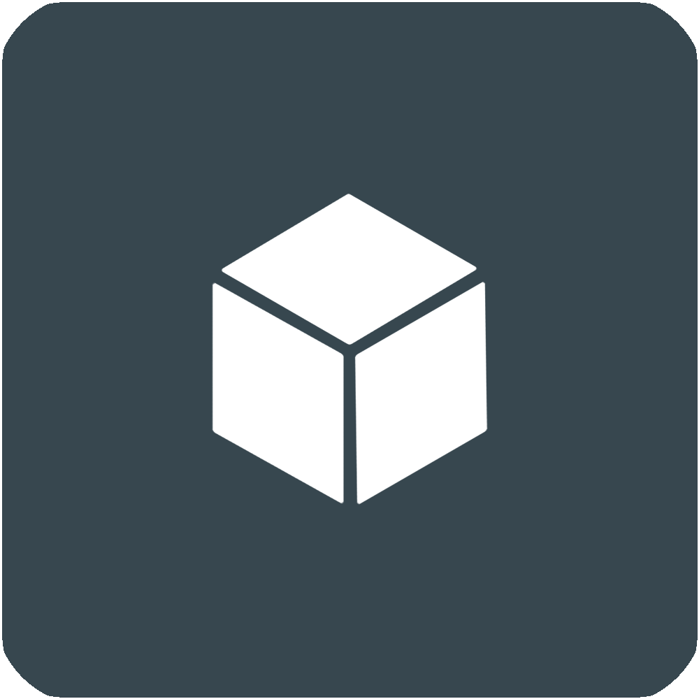

    <h1>媒体盒子</h1>
    

        
        
        
        
        
    

插件化媒体容器，不含广告，免费开源，便于学习Android开发。

---

## 🗃️功能

作为**插件容器**提供数据展示视图

插件简单实现[插件API](https://github.com/RyensX/MediaBoxPlugin)的组件解析数据即可得到一个完整APP

如一个看视频的APP、一个看漫画的APP，并且多个插件内容可聚合
[MediaBox示例插件-樱花动漫第三方客户端](https://github.com/RyensX/SakuraAnime2Plugin)

## ⚡下载&使用

* [正式Release包](https://github.com/RyensX/MediaBox/releases/latest)
* [自动构建Debug包](https://github.com/RyensX/MediaBox/actions/workflows/android_debug.yml)(**不稳定**，适合体验最新功能，可与Release包共存，[下载指南](doc/auto_build_apk_download.md))
* [官方插件仓库](https://github.com/RyensX/MediaBoxPluginRepository)

---

* ### 如果觉得不错，欢迎⭐**Star**
* ### 如果有什么想法或建议，欢迎讨论或PR(**请尽量贴合项目的源码和commit风格**)

---

## 🔒安全说明

**请勿**私自**传播APK**安装包，Github仓库为唯一长期仓库，**请仅在Github仓库下载安装包**，请勿下载来历不明的插件，谨防恶意代码！

## 📌免责声明

1. 此软件**只负责数据展示**，本身**不提供任何数据**，和普通浏览器功能类似。
2. 此软件显示的所有内容，其**版权**均**归原作者**所有。
3. 此软件**仅可用作学习交流**，未经授权，**禁止用于其他用途**，请在下载**24小时内删除**。
4. 因使用此软件产生的版权、安全、政策等问题，软件作者概不负责。

## 🔍相关项目

- [Imomoe](https://github.com/SkyD666/Imomoe)
- [插件API](https://github.com/RyensX/MediaBoxPlugin)

## 🚗构建相关

- [**secret.gradle**](doc/about_secret.gradle.md) - 构建秘钥文件，请自行添加到项目跟目录
- **notice.iml** - 使用协议等，请自行添加到res/raw

## 许可证

使用此软件代码需**遵循以下许可证协议**

[**GNU General Public License v3.0**](LICENSE)
