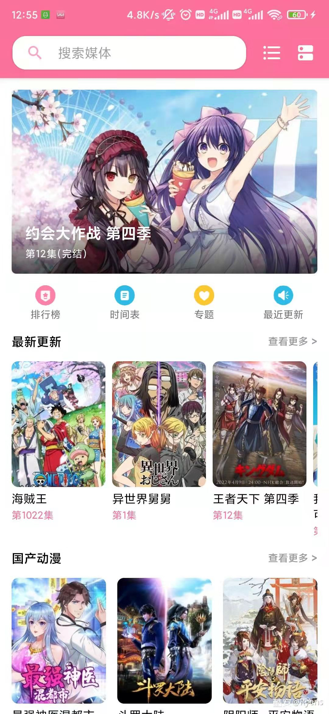
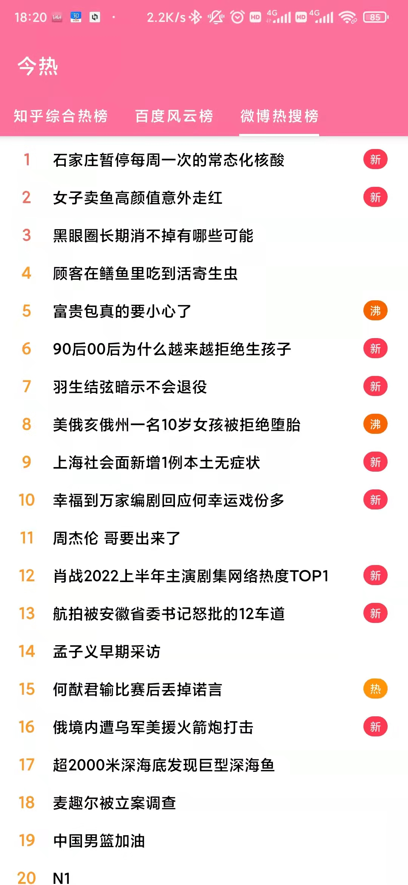
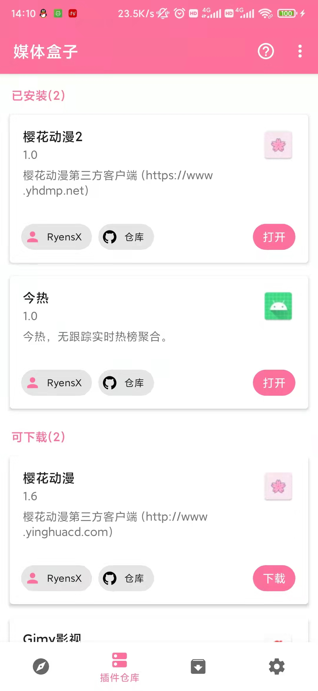

    <h1>媒体盒子</h1>
    

        
        
        
        
        
    

全能媒体容器，插件化网罗天下媒体，畅快学习软件开发。

---

## 概述

实现了类似微信小程序的框架，只需要简单实现插件API提供数据到容器即可快速成型，方便学习爬虫、APP开发等。

容器主要为插件提供以下服务：
* 数据自动渲染到UI(视图组件)
* 媒体收藏/历史记录
* 周期性媒体数据检查服务(插件只需要实现媒体检查更新组件即可被主动检查更新)
* 视频播放组件(播放器)，支持手势控制/夜间模式/弹幕/倍速控制/多集聚合/横竖旋转适应等
* 私有可视化KV存储(插件私有配置)
* 个人数据/插件云端备份(WebDav,开发中)
* ...

如实现一个看视频的APP、一个看漫画的APP，并且多个插件内容可聚合

- 示例 [樱花动漫第三方客户端](https://github.com/RyensX/SakuraAnime2Plugin)
- 示例 [今热-无跟踪实时热榜聚合](https://github.com/RyensX/TodayHot)

### [**插件开发指南**](https://github.com/RyensX/MediaBox/wiki)

## 截图

    
  

## 下载&使用

见[官网网站](https://ryensx.github.io/MediaBoxPluginRepository/)

## 支持开发

* #### ⭐**Star**鼓励开发者
* #### 👁️Watch关注开发进度
* #### 📇Pull requests(**请尽量贴合项目的源码和commit风格**)
* #### 💡加入[群组](https://t.me/MediaBoxGithub)讨论反馈

## 安全说明

**请勿**私自**传播APK**安装包，Github仓库为唯一长期仓库，**请仅在Github仓库下载安装包**，请勿下载来历不明的插件，谨防恶意代码！

## 免责声明

1. 此软件**只负责数据展示**，本身**不提供任何数据**，和普通浏览器功能类似。
2. 此软件显示的所有内容，其**版权**均**归原作者**所有。
3. 此软件**仅可用作学习交流**，未经授权，**禁止用于其他用途**，请在下载**24小时内删除**。
4. 因使用此软件产生的版权、安全、政策等问题，软件作者概不负责。

## 相关项目

- [Imomoe](https://github.com/SkyD666/Imomoe)
- [插件API](https://github.com/RyensX/MediaBoxPlugin)
- [官方插件仓库](https://github.com/RyensX/MediaBoxPluginRepository)

## 构建相关

- [**secret.gradle**](doc/about_secret.gradle.md) - 构建秘钥文件，请自行添加到项目跟目录
- **notice.iml** - 使用协议等，请自行添加到res/raw

## 许可证

使用此软件代码需**遵循以下许可证协议**

[**GNU General Public License v3.0**](LICENSE)
