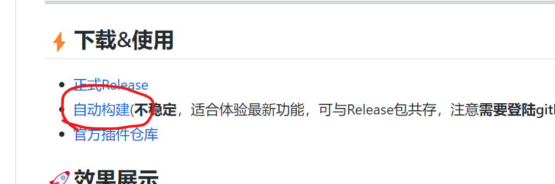
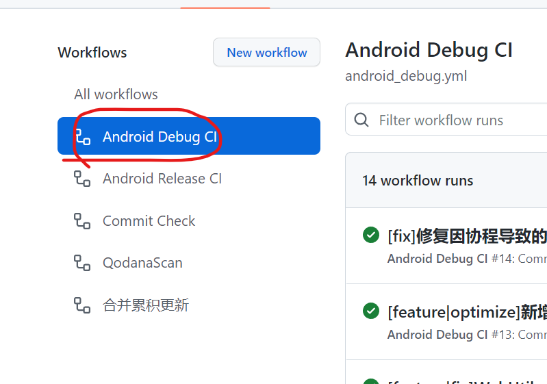
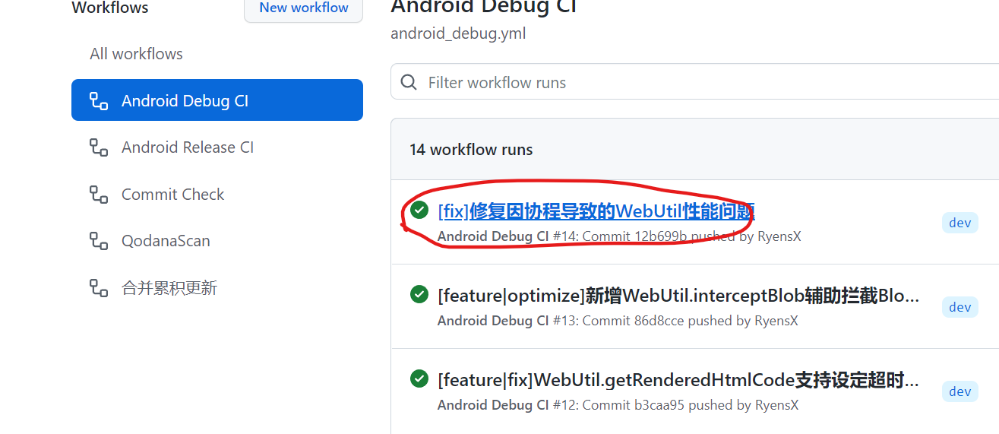
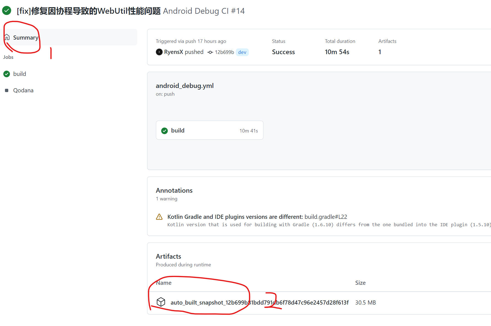

# 自动构建Apk下载指南

### 💡首先，你应该**先登录Github**才能下载Artifacts

### 步骤1

点击按钮进入Acions

切换到**Android Debug CI**

### 步骤2

选择一个检查通过的commit(绿色打钩的)点击进入

### 步骤3

点击切换到Summary

然后点击下方**Artifacts**即可下载包含安装包的压缩包（注意要登陆才能下载）

### 最后，给项目右上角点个Star吧

