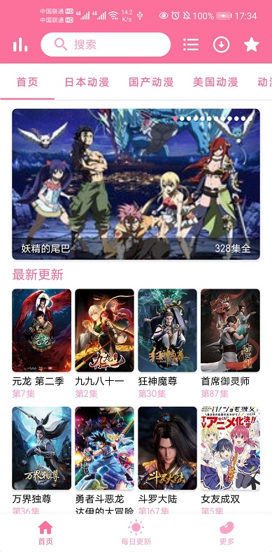
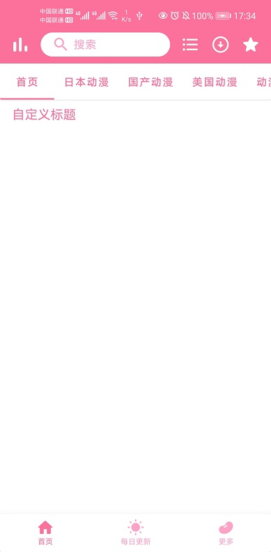
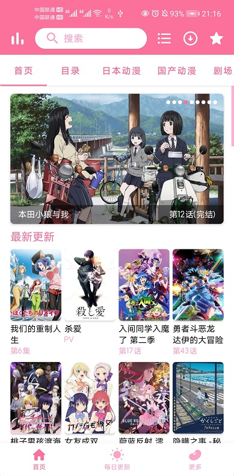

# 自定义数据源💡

想显示**更多内容？**想用已有的**API接口**的数据？想**自定义**显示**数据**？

使用自定义数据源功能即可满足您。

## **快捷导航：大部分普通用户可以只看①-④**

## [①使用已有的自定义数据源](#一-使用已有的自定义数据源)

## [②示例代码和ads包](#例子)

## [③删除数据源](#二-删除数据源)

## [④恢复默认数据源](#三-恢复默认数据源)

## [⑤自制数据源(高级)](#四-自制数据源)

## 什么是自定义数据源？

自定义数据源可更改APP的数据显示。

如默认情况下首页显示**正常数据**（下方第一幅图）；自定义数据源，可以让首页**仅显示“自定义标题”五个字**（下方第二幅图）、显示其它网站或API接口数据（下方第三幅图）

  

## 如何使用自定义数据源功能？

### 一 使用已有的自定义数据源

### **>>已有的ads包可从[此处](#例子)找到<<**

#### 1.将ads包放入手机

#### 2.找到ads文件


#### 2.使用此应用打开ads(即选择打开方式)


#### 3.在配置界面导入自定义数据源ads包，点击确定


#### 4.点击列表里已有的数据源，选择重启APP，重启后即可生效


### 二 删除数据源

#### 1.进入配置自定义数据源页面，长按列表中的数据源


#### 2.点击确定，即可删除


### 三 恢复默认数据源

#### 1.进入配置自定义数据源页面，点击右上角恢复按钮


#### 2.点击重启，即可恢复


### 四 自制数据源

自己编写ads包(熟悉**Kotlin**，最好能够了解Android的基础知识)

#### 1.实现您想要自定义数据的Kotlin接口

包：**com.skyd.imomoe.model.interfaces**

接口：

- IAnimeDetailModel
- IAnimeShowModel
- IClassifyModel
- IEverydayAnimeModel
- IHomeModel
- IMonthAnimeModel
- IPlayModel
- IRankModel
- ISearchModel
- IRankListModel
- IEverydayAnimeWidgetModel
- IRouteProcessor
- IUtil
- IConst

注：

1. IBase为所有Model接口的父接口，具体**接口含义**以及接口方法的**参数含义和返回值含义**见**接口注释**。
2. 接口中的所有**获取数据的方法**在**IO线程**运行。
3. 接口中的所有**获取数据的方法通过返回值返回数据**。若在方法中使用到了**回调**，请使用**Kotlin协程**将**回调转换为协程**。

#### 2.实现类的类名

确保所有实现类的**类名**为**Custom去掉第一个字母I的接口名**，例如**IAnimeDetailModel**的实现类为**CustomAnimeDetailModel**

注：未实现的接口默认使用原始数据。由于不同数据源相应操作差不大，不建议只实现一部分接口

#### 3.实现类的包

确保所有实现类的**包**为**com.skyd.imomoe.model.impls.custom**

#### 4.将实现类打包为普通的jar文件

#### 5.生成含dex的jar文件

通过普通的jar文件生成含dex的jar文件，参考指令：dx --dex --output=G:\CustomDataSource.jar E:\Android\Imomoe\app\build\libs\CustomDataSource.jar

#### 6.将jar包后缀名改为ads

例如CustomDataSource.jar改名为CustomDataSource.ads

## 例子

详细代码和**ads包**见下方链接内容。注：此ads包可直接导入（步骤6）供APP使用。**请自行在此仓库检查ads包更新**。

**[示例1](sample1)  [示例2](sample1)**

## 其他

可直接使用的类及工具等：

```
com.skyd.imomoe.model.interfaces.**
com.skyd.imomoe.model.util.**
com.skyd.imomoe.util.html.source.**
com.skyd.imomoe.util.eventbus.**
com.skyd.imomoe.util.Util
com.skyd.imomoe.util.ToastKt
com.skyd.imomoe.bean.**
com.skyd.imomoe.config.**
org.jsoup.**
org.greenrobot.eventbus.**
kotlin.**
kotlinx.**
```

**表示包下的类、接口等，包括子包下的内容。

其它类、接口、方法等可能会被**混淆**，**不可使用**，具体混淆规则见工程文件。

## 备注⚠

由于本人技术有限，不保证后续此功能的接口不发生大更改。